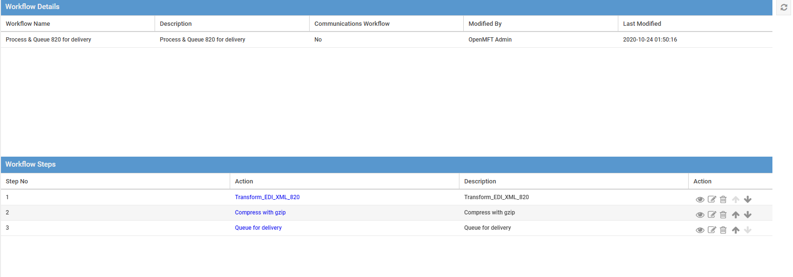
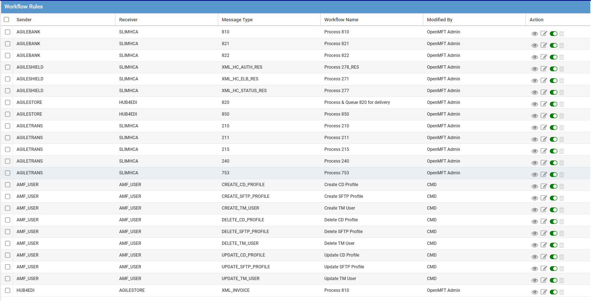

# 2.5 Workflow

### 2.6 Workflow Actions

Workflow Actions rely on "Action types", which  are the smallest units of work that are used in workflow definitions to form a sequence of steps.  Default action types made available in OpenMFT are:

* Deliver -&gt; If used without any changes to Receiver, Message Type, or File Format, messages are put in Delivery Queue for scheduled pickup.  Typical AMF messages use this as the default action inside a workflow definition.
* EOL Conversion -&gt; End Of Line conversion from one OS to another
* Call Web Service -&gt; Web service action in the workflow
* Gunzip -&gt; De-compress a .gz file
* Gzip -&gt; Compress a file to a .gz format
* Mailbox -&gt; Mailbox in /Inbox
* Run Script -&gt; Allows one to invoke a Python module
* Route -&gt; Route the message to an alternate receiver with a new message type so the workflow that corresponds to that combination of Sender, Receiver and Message Type could be invoked.

Most often used action types is: Deliver

### 2.7 Workflow Definitions

Workflow definitions contain one or more Actions as a sequence of steps.  Workflow definitions are like an itinerary that executes a sequence of steps or Actions that are defined.  Here is an example of a Workflow Definition with Transform , Compress with Gzip & Queue for delivery using Call Web Service, Gzip & Deliver action types respectively:

### 2.8 Workflow Rules

Workflow Rules invoke a defined Workflow Definition for a given combination of Sender, Receiver & Message Type.  Here are a few examples of Workflow Rules:

###  

