# 5.0 OpenMFT User Manual

## 5.1 **Introduction**

OpenMFT User Manual is meant to walk you through the different aspects of the system.

It helps you configure Customers, Users \(Trading Partners in SFG\), Message Types, Message Mapping, Workflow Rules, Communication Rules, etc.  You will notice that "AMF" is used through out system.  AMF is a commercial product serviced by Agile Data Inc based on which OpenMFT is built on.  OpenMFT has all the base features of AMF and hence the re-use.

## **5.2 Signup Form**

To register a new user click on the **Signup** button

Enter the user details and click on the **Signup** button

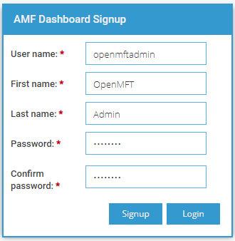

You will get a prompt that your account has been created and you may login after it is approved.  Either the "Superuser" created during the install process or another logged user with administrator rights should approve your signup for you to login.

## **5.3 Login Form**

OpenMFT User can login into the application by entering username and password

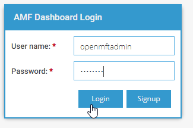

**Note**: Admin has to approve the user account, otherwise user can’t login

Once the user logs in, the application redirects based on vault redirection screen setting\(**DEFAULT\_SCREEN\)**. It will redirect to the corresponding screen.

## **5.4 Dashboard**

Click on **Dashboard** which is on the left menu, it displays multiple dashboards which gives an overview of the data for the last one week.

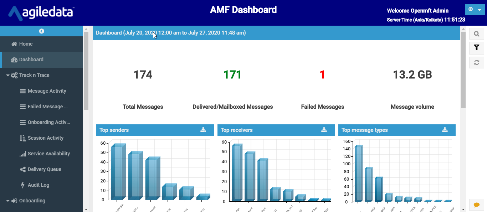

We can drill down dashboard visualizations by filter by datetime range.

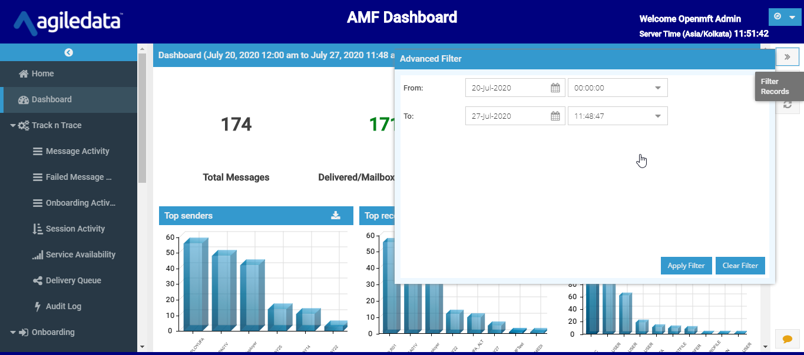

On doubleclick of dashboard visualizations each item it will redirect to corresponding message activity list page.

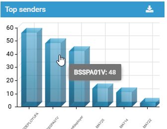 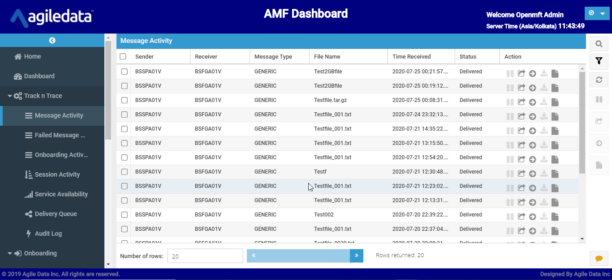

On click on the download icon download dashboard png image or if you right click on dashboard you can see the context menu for downloading dashboard image.

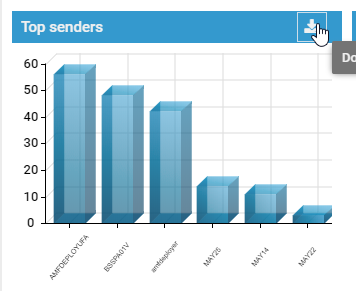 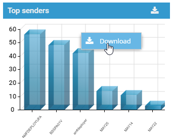

Click on **Clear Filter** which clears the filtered dashboard datetime range.

## **5.5 Track n Trace**

### **5.5.1 Message Activity**

Click on the Track n Trace → Message Activity in the left navigation bar. It displays the list of records \(by default 23\),

 Message Activity pagesize is configurable in vault setting \(**MessageActivityPageSize\)**

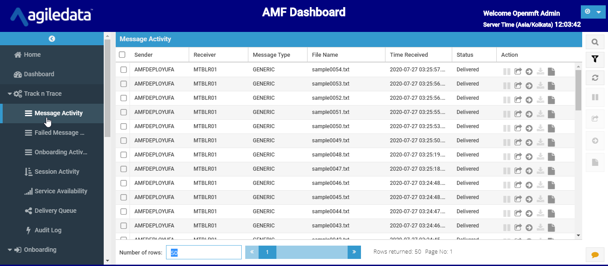

Click on **“Filter Records”** and enter the details to filter the data and click on the **Apply Filter** button

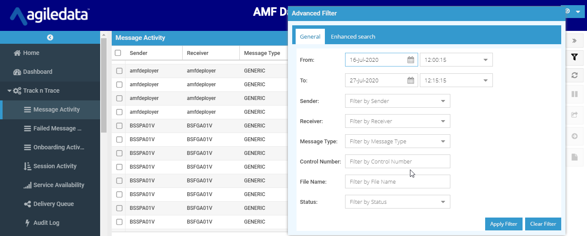

Click on **Clear Filter** which clears the filtered data

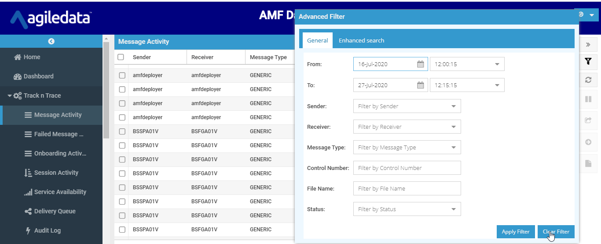

Click on **Refresh** which refreshes the current page records

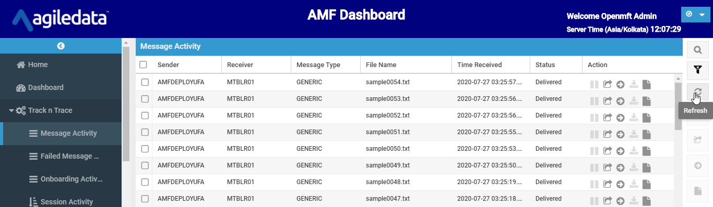

Click on **Hold**, it asks for reason to hold the record

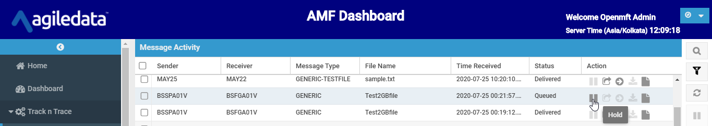

Enter the reason and click on the save button.

Click on **Requeue** , it requeue the message and status changes to Queued.

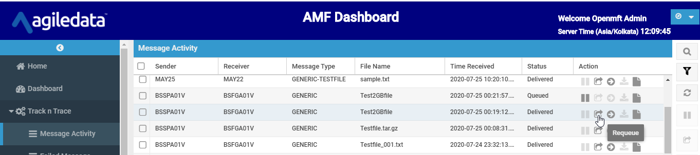

Click on **Reprocess,** it reprocess the message and status will change to Requeued.

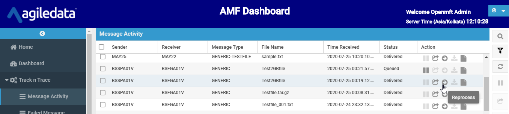

Click on the **Download File**, it downloads the message. Based on the vault setting\(**MADownloadButton\)** we can enable the download icon in the list page.

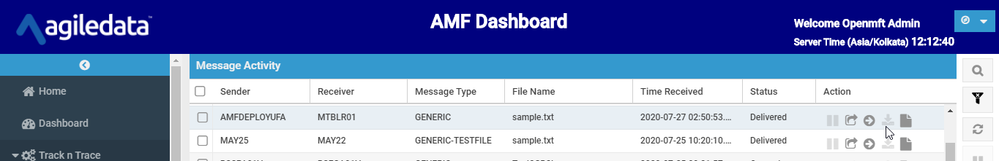

Click on **Notes**.

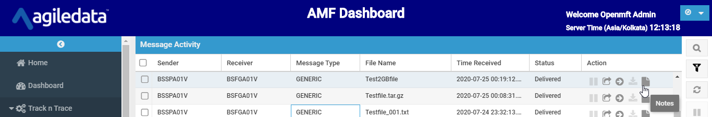

Write the Notes for the message and click on the **Save** button.

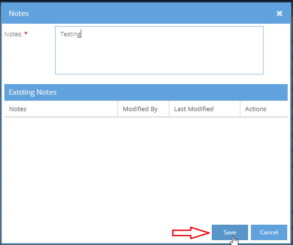

If you want to hold multiple messages at a time filter status with ”Queued” , then Click **Hold,** it asks for reason to hold the record.

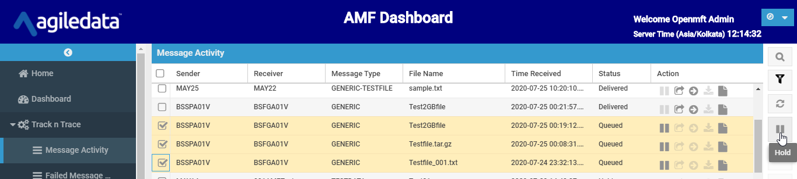

Enter the reason and click on the save button.

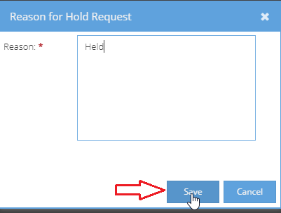

If you want to requeue multiple messages at a time select possible messages, then click on **Requeue,** it requeue the messages and status will change to Queued.

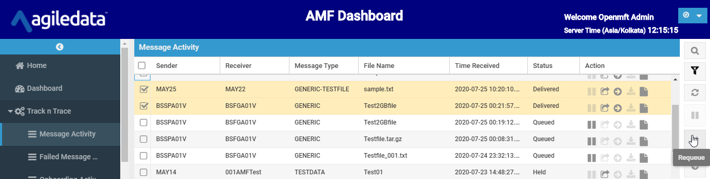

If you want to reprocess multiple messages at a time filter status with ”Completed” , then click on **Reprocess,** it reprocess the messages and status will change to Requeued.

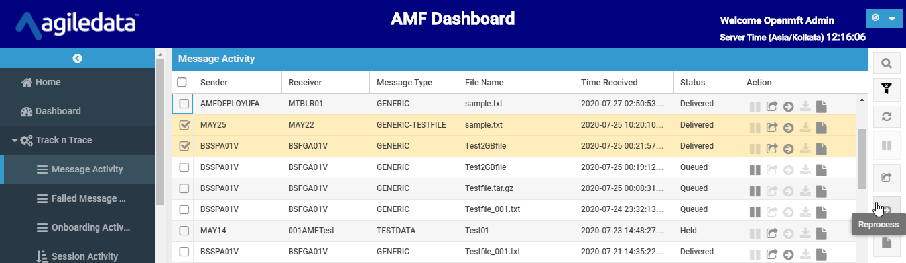

If you want to write **Notes** to multiple messages at a time then click on **Notes** .

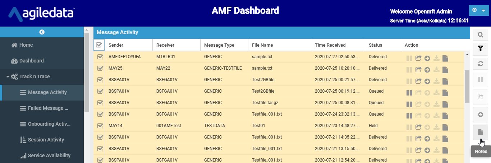

Write Notes in the pop up. It will add notes to all Selected messages.

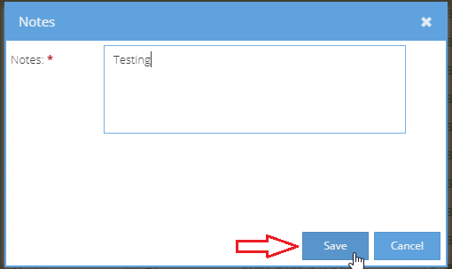

Double click on the row to view the details page of Message activity

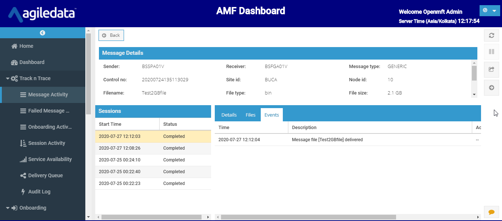

Here also you can hold or reprocess or requeue a record by clicking on **Hold** or **Reprocess** or **Requeue** icons on the left action toolbar. To go back to the list page click on the **Back** button.

### **5.5.2 Failed Message Activity**

Click on the Track n Trace → Failed Message Activity in the left navigation bar. It displays the list of records \(by default 23\)

Failed Message Activity pagesize is configurable in vault setting \(**MessageActivityPageSize\)**

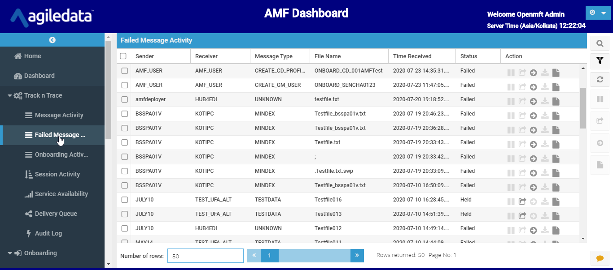

Here we are able to see the failed message activity details.Functionalities of **Hold**,**Requeue**, **Reprocess** ,**Download File** and **Add Notes** functionalities remains same which is in Message Activity Screen.

### **5.5.3 Onboarding Activity**

Click on the Track n Trace → Onboarding Activity in the left navigation bar. It displays the list of records\(by default 23\)

Onboarding Message Activity pagesize is configurable in vault setting \(**MessageActivityPageSize\)**

## 

Here we can see the onboarding activity details.Functionalities of **Hold**,**Requeue**, **Reprocess** ,**Download File** and **Add Notes** functionalities remain the same which is in Message Activity Screen.

### **5.5.4 Session Activity**

Click on the Track n Trace → Session Activity in the left navigation bar. It displays the list of records .

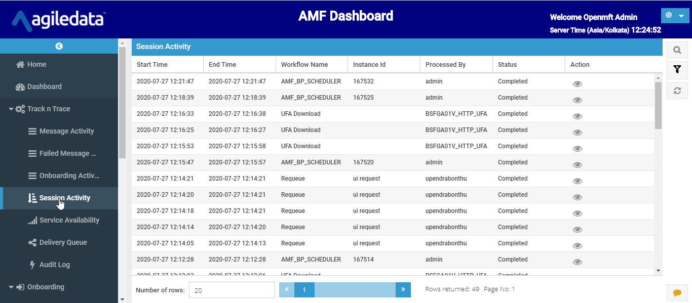

Click on **“Filter Records”** and enter the details to filter the data and click on the **Apply Filter** button.

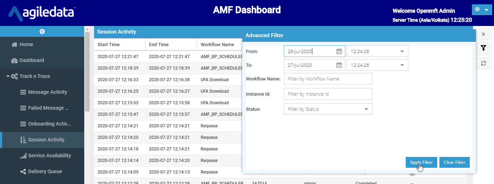

Click on **“Clear Filter”** which clears the filtered data.

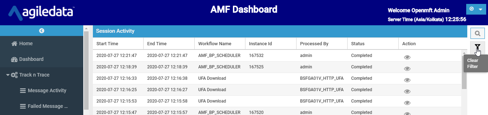

Click on **Refresh** which refreshes the current page records

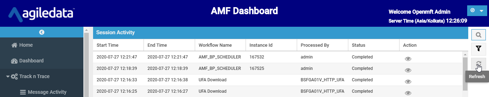

Click on **“View Session Details”** in action column to view the details of the record

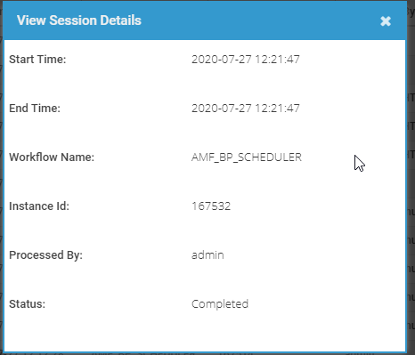

Click on ‘X’ to close the popup window

Double click on the row to view the details page of Session Activity.

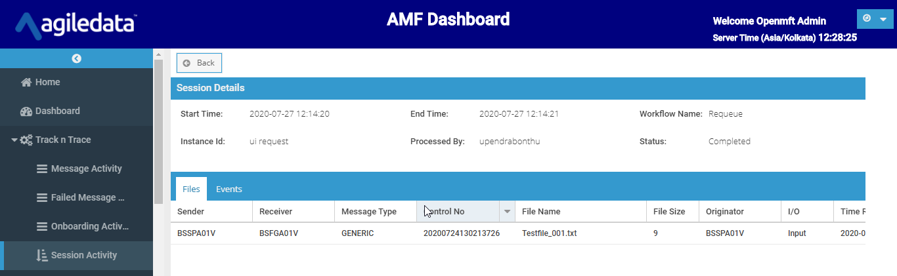

To go back to list page click on the **Back** button

### **5.5.5 Service Availability**

Click on the Track n Trace → Service Availability in the left navigation bar. It displays the list of records .

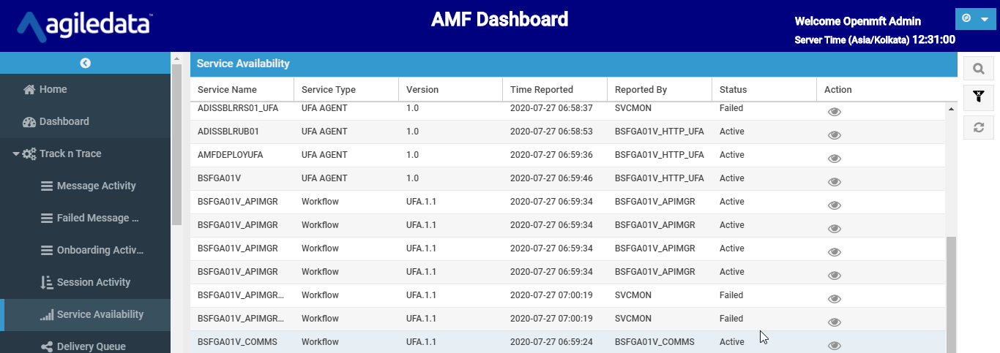

Click on **“Filter Records”** and enter the details to filter the data and click on the **Apply Filter** button.

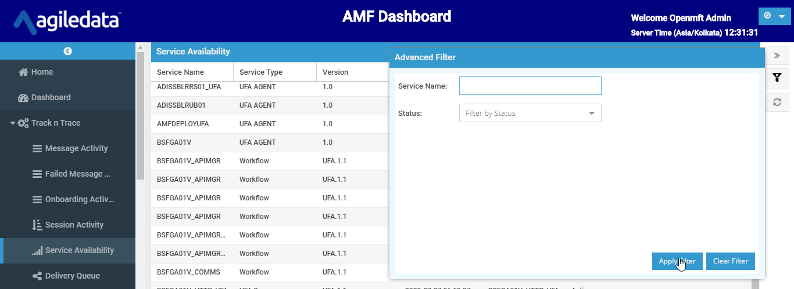

Click on “Clear Filter” which clears the filtered data.

Click on **Refresh** which refreshes the current page records

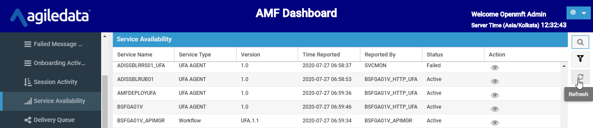

Click on **“View Service Availability Details”** in action column to view the details of the record

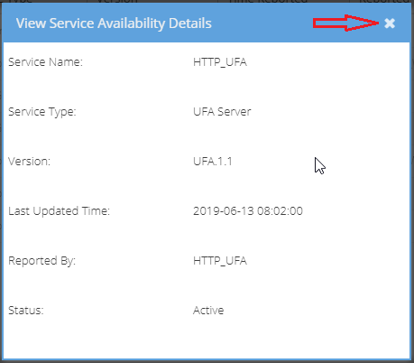

Click on ‘X’ to close the popup window

Double click on the row to view the details page of Service Availability.

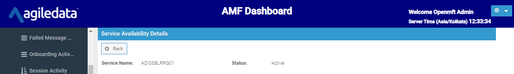

To go back to list page click on the **Back** button

### **5.5.6 Delivery Queue**

Click on the Track n Trace → Delivery Queue in the left navigation bar. It displays the list of records \(by default 23\)

Delivery queue pagesize is configurable in vault setting \(**DEFAULT\_PAGE\_SIZE\)**

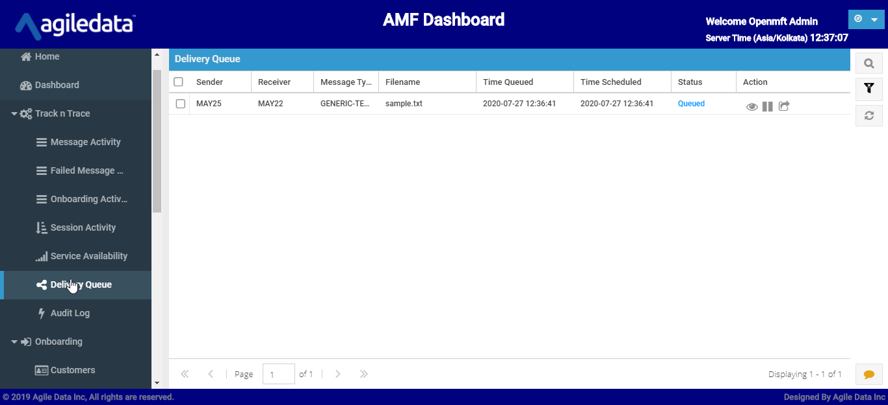

Click on **“Filter Records”** and enter the details to filter the data and click on the **Apply Filter** button

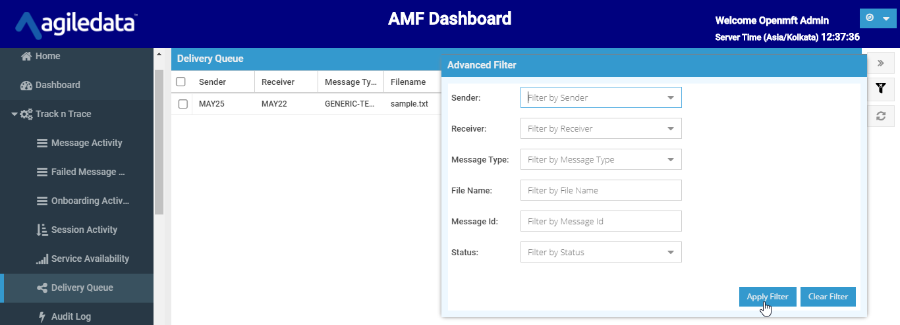

Click on **“Clear Filter”** which clears the filtered data

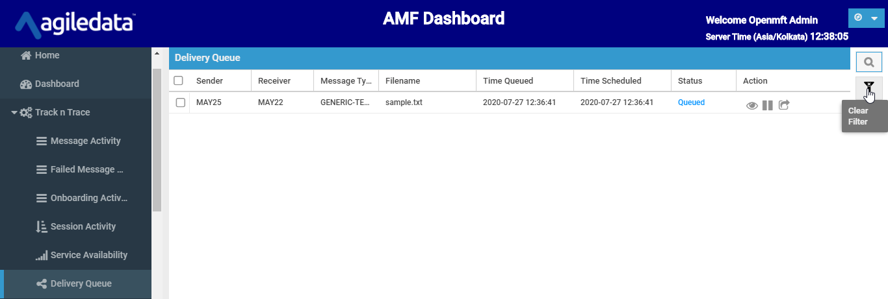

Click on **Refresh** which refreshes the current page records

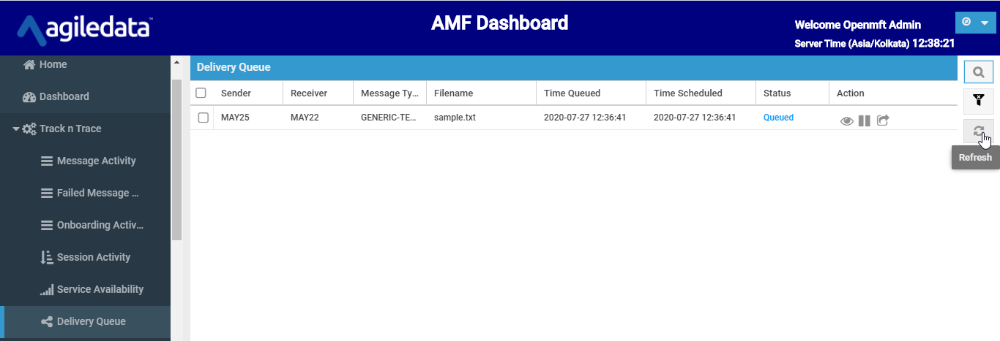

Click on **“View Delivery Queue Item”** in action column to view the details of the record

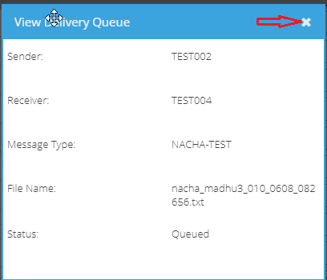

Click on ‘X’ to close the popup window

Click on Hold ,it asks for reason to hold the record

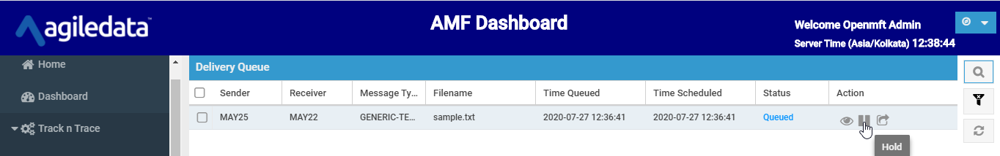

Enter the reason and click on the Save button

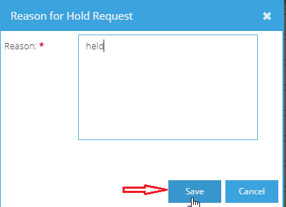

The record which was held will go to message activity with Held status

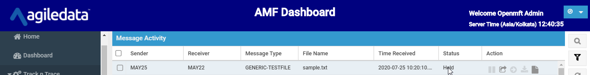

Click on Reschedule in action column

When the record was rescheduled the Time Scheduled column time will be set to present time

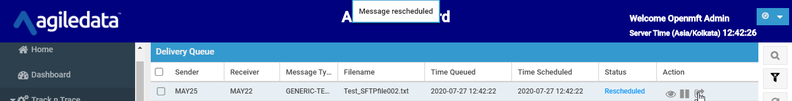

Click on multiple checkboxes and click on **Hold** to hold multiple records

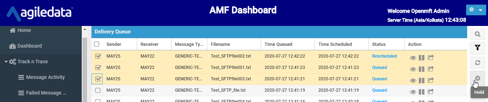

Enter the reason to hold multiple records and click on the **Save** button

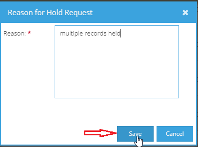

Click on multiple checkboxes and click on **Reschedule** to reschedule multiple records

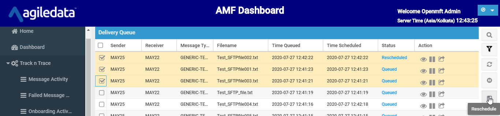

When the records was rescheduled the Time Scheduled column time will be set to present time

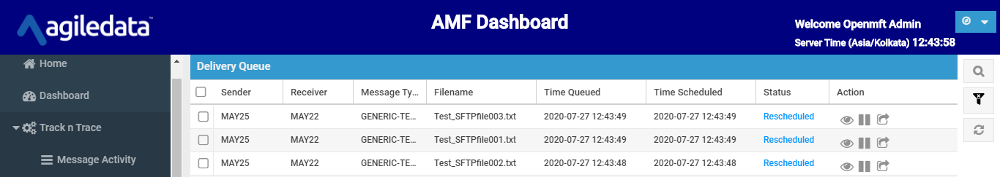

Double click on the row to view the details page of Delivery queue


Here also you can hold or reschedule a record by clicking on **Hold** or **Reschedule** icons on the left action toolbar. To go back to list page click on the **Back** button

### **5.5.7 Audit Log**

Whenever action is performed by the user it captures those information and will be listed in the audit log list page.

Click on the Track n Trace → Audit Log in the left navigation bar. It displays the list of records \(by default 15\)


Click on **“Filter Records”** and enter the details to filter the data and click on the **Apply Filter** button


Click on **Clear Filter** which clears the filtered data


Click on **Refresh** which refreshes the current page records

Click on the eye icon or double click on the row to view details of that particular record.

Click on the cross icon close view details window.

## **5.6 Onboarding**

### **5.6.1 Customers**

Click on Onboarding → **Customers** from left navigation menu and click on the **Add New**


Enter the details of the customer and click on the **Save** button


**Note**: After successful adding of the record it will display a toast message as **“Customer Created”**

Click on **“Filter Records”** \(search icon\) and enter customer name,billing id.

Click on the **“Apply Filter”** to filter the Customer Data


**Note**: State \(All/Enabled/Disabled\) - All will filter all the customer records, Enabled will filter only enabled records, Disabled will filter only disabled records.

Click on **“View Customer”** to view the details of the customer


Click ‘X’ to close the window popup

Click on **“Edit Customer”** from action column or double click on the row it will open the details grid where you can update the customer data by double clicking on the field and click on the **Update** button.


**Note**: Customer and Billing Id fields can’t be edited. After a successful update of the record it will display a toast message as **“Customer Updated”.**

Click on the **Back** button to go back to the list page.

Click on the **“Enabled”** from the action column to disable the record; likewise after disabling the record click on **“Click here to enable”** to enable the record.


Click on “Clear Filter” which is on right side to clear the filtered data.

Click on “Refresh” which updates/refreshes the current page.


Select multiple records by clicking on checkboxes and click on “Disable Selected”.


Click on **“Yes”** button to disable the selected records.


Select multiple records by clicking on checkboxes and click on “Enable Selected”.


Click on **“Yes”** button to enable the selected records


Click on **“Delete Customer”** from action column and click on **“Yes”** button to delete the customer record.


**Note**: After successful deletion of the record it will display a toast message as **“Customer Deleted”.**

## 

Click on “Export” which can export total records of customers.


We can export selected records through Filter or select on grid.


### **5.6.2 Users**

Click on Onboarding → **Users** from left navigation menu and click on the **Add New.**


Enter the details of the user and click on the **Save** button.


**Note**: After successful adding of the record it will display a toast message as **“User Created”,**

Based on usertype the process of user creation will vary, if usertype is External with Use Global Mailbox as checked then in onsave it triggers a workflow which creates a partner in Global Mailbox, if Use Global Mailbox is unchecked then it creates partner in Traditional mailbox.

If usertype is AMF it only creates the record in the database.

If you want to see the status of the workflow process of partner creation click on Status column in list page, then it opens the Message Activity details page with sequence of partner creation process.

Click on **“Filter Records”** \(search icon\) and enter user name,customer name,.

Click on the **“Apply Filter”** to filter the User Data


**Note**: User States can be as follows \(All/Enabled/Disabled\)

**All** will filter all the customer records

**Enabled** will filter only enabled records

**Disabled** will filter only disabled records

Click on **“View User”** to view the details of the user


Click ‘X’ to close the window popup

Click on **“Edit User”** from action column or double click on the row it will opens the details grid where you can update the user data by double clicking on the field and click on the **Update** button


**Note**: User Name field can’t be editable, after successful updation of the record it will display a toast message as **“User Updated”**

Click on the **Back** button to go back to list page

Click on the **“Enabled”** from action column to disable the record , likewise after disabling the record click on **“Click here to enable”** to enable the record


Click on “Clear Filter” which is on right side to clear the filtered data


Click on “Refresh” which updates/refreshes the current page.


Select multiple records by clicking on checkboxes and click on “Disable Selected”


Click on **“Yes”** button to disable the selected records.


Select multiple records by clicking on checkboxes and click on “Enable Selected”


Click on **“Yes”** button to enable the selected records


Click on **“Delete User”** from action column and click on **“Yes”** button to delete the user record


**Note**: After successful deletion of the record it will display a toast message as **“User Deleted”**

## 

Click on “Export” which can export total records of users with comm profile.


We can export selected records through Filter or select on grid.


### **5.6.3 Communication Profile**

Click on Onboarding → Users, in user list page click on “Edit User” or double click on the row


Click on “Add Communication Profile” \(plus icon\) form right side action toolbar


Select the Protocol and enter the details of it and click on the **Save** button


**Note**: After successful adding of the record it will display a toast message as **“Communication Profile Created”.**

If Type is Customer Initiated and protocol id CD then it triggers a workflow process in backend and creates nodes in SI and sspcm.

If Type is Customer Initiated and protocol id SFTP then it triggers a workflow process in backend and creates user in LDAP.

The entire workflow process creation sequence of steps will be displayed if you click on Status column in list page.

Click on **‘View’** from action column to see the details of Communication Profile


Click ‘X’ to close the popup

Click on **‘Edit’** from action column or double click on the row to update the data if required


Click on the **Update** button.

**Note**: Profile Name and Protocol Name field can’t be editable, after successful updation of the record it will display a toast message as **“Communication Profile Updated”**

Click on **Delete f**rom action column.


Click **‘Yes’** button to delete the record

**Note**: After successful deletion of the record it will display a toast message as **“Communication Profile Deleted”**

### **5.6.4 Message Types**

Click on Onboarding → **Message Types** from left navigation menu and click on the **Add New**


Enter the details of the message types and click on the **Save** button

**Note**: After successful adding of the record it will display a toast message as **“Message Type Created”**

Click on **“Filter Records”** \(search icon\) and enter message type.

Click on the **“Apply Filter”** to filter the Message Type Data.


Click on **“View Message Type”** to view the details of the message type.

Click ‘X’ to close the window popup

Click on **“Edit Message Type”** from action column or double click on the row it will opens the details grid where you can update the message type data by double clicking on the field and click on the **Update** button


**Note**: Message Type field can’t be editable, after successful updation of the record it will display a toast message as **“Message Type Updated”**

Click on the **Back** button to go back to list page

Click on “Clear Filter” which is on right side to clear the filtered data


Click on “Refresh” which updates the current page.


Click on **“Delete Message Type”** from action column and click on **“Yes”** button to delete the message type record


**Note**: After successful deletion of the records it will display a toast message as **“Message Type Deleted”**

## 

Click on “Export” which can export total records of message types.

We can export selected records through Filter or select on grid.


### **5.6.5 Message Mapping**

Click on Onboarding → **Message Mapping** from left navigation menu and click on the **Add New**

Enter the details of the message mapping and click on the **Save** button


**Note**: After successful adding of the record it will display a toast message as **“Message Mapping Created”**

Click on **“Filter Records”** \(search icon\) and enter the sender, receiver, message type.

Click on the **“Apply Filter”** to filter the Message Mapping Data.


Click on **“View File Mapping”** to view the details of the message mapping.


Click ‘X’ to close the window popup

Click on **“Edit Message Mapping”** from action column or double click on the row it will opens the details form where you can update the message mapping data and click on the **Update** button


**Note**: After successful updation of the record it will display a toast message as **“Message Mapping Updated”**

Click on the **Back** button to go back to list page

Click on “Clear Filter” which is on right side to clear the filtered data


Click on “Refresh” which updates the current page


Click on **“Delete File Mapping”** from action column and click on **“Yes”** button to delete the message mapping record


**Note**: After successful deletion of the records it will display a toast message as **“Message Mapping Deleted”**

## 

Click on “Export” which can export total records of message mapping.


We can export selected records through Filter or select on grid.


### **5.6.7 Workflow**

#### **5.6.7.1 Definitions**

Click on Onboarding →workflow→ **Definitions** from left navigation menu and click on the **Add New**


Enter the details of the workflow Definition and click on the **Save** button


**Note**: After successful adding of the record it will display a toast message as **“Workflow Definition Created”.**

Click on **“Filter Records”** \(search icon\) and enter workflow name.

Click on the **“Apply Filter”** to filter the definition data.


**Note**: State \(All/Enabled/Disabled\) - All will filter all the workflow definition records, Enabled will filter only enabled records, Disabled will filter only disabled records.

Click on **“View Workflow Definition”** to view the details of the workflow definition.

Click ‘X’ to close the window popup.

Click on **“Edit Workflow Definition”** from action column or double click on the row it will opens the details grid where you can update the workflow definition data by double clicking on the field and click on the **Update** button.


**Note**:

1. If workflow definition is added in workflow rules.We can't edit workflow definition ,we can’t add workflow steps for workflow definition.

2. After successful updation of the record it will display a toast message as **“Workflow Definition Updated”.**

Click on the **Back** button to go back to list page.

#### **Workflow Step**

Adding **Workflow Step** for workflow definition. On Click on **“Add”** icon in workflow definition details open add workflow step popup window.


Enter the details of the workflow Step and click on the **Save** button


**Note**: After successful adding of the record it will display a toast message as **“Workflow Step Created”.**

Click on the “**Edit Icon**” in action column or double click on the row in workflow definition details workflow steps list open update workflow step popup window. Enter updated details Click on the **Update** button to update the workflow step.


Click on the **“Eye Icon”** in action column in row to view details of workflow step.


Click ‘X’ to close the window popup.

Click on **Workflow action column** in workflow steps list row to view the details of workflow action.


Click ‘X’ to close the window popup.

Click on **Move Up** and **Move Down** Arrows in workflow steps list change order of workflow steps.


Click on **“Delete workflow step”** from action column and click on **“Yes”** button to delete the workflow step record.


Click on the **“Enabled”** from the action column to disable the record , likewise after disabling the record click on **“Click here to enable”** to enable the record.


Click on “**Clear Filte**r” which is on right side to clear the filtered data


Click on “**Refresh**” which updates the current page


Click on the **“Copy Icon”** open copy window. On Click ‘Save’ copy the workflow definition with particular workflow steps.

Select multiple records by clicking on checkboxes and click on “**Disable Selected**”.


Click on **“Yes”** button to disable the selected records.

Select multiple records by clicking on checkboxes and click on “**Enable Selected**”.


Click on **“Yes”** button to enable the selected records.


Click on **“Delete Workflow Definition”** from the action column and click on the **“Yes”** button to delete the Workflow definition record.


**Note**: After successful delete of the records it will display a toast message as **“Workflow Definition Deleted”.**

## 

Click on “Export” which can export total records of workflow definitions with workflow steps.


We can export selected records through Filter or select on grid.


## 

#### **5.6.7.2 Actions**

Click on Onboarding →workflow→ **Actions** from left navigation menu and click on the **Add New**


Enter the details of the workflow action and click on the **Save** button

**Note**: After successful adding of the record it will display a toast message as **“Workflow Action Created”.**

Click on **“Filter Records”** \(search icon\) and enter action name, action type.

Click on the **“Apply Filter”** to filter the Action Data.


**Note**: State \(All/Enabled/Disabled\) - All will filter all the workflow action records, Enabled will filter only enabled records, Disabled will filter only disabled records.

Click on **“View Action”** to view the details of the workflow action.


Click ‘X’ to close the window popup.

Click on **“Edit Action”** from the action column or double click on the row. It will open the details grid where you can update the workflow action data by double clicking on the field and clicking on the **Update** button.


**Note**: After successful updation of the record it will display a toast message as **“Workflow Action Updated”.**

Click on the **Back** button to go back to list page.

Click on the **“Enabled”** from action column to disable the record , likewise after disabling the record click on **“Click here to enable”** to enable the record.


Click on “**Clear Filte**r” which is on right side to clear the filtered data


Click on “**Refresh**” which updates the current page


Select multiple records by clicking on checkboxes and click on “**Disable Selected**”.


Click on **“Yes”** button to disable the selected records.


Select multiple records by clicking on checkboxes and click on “**Enable Selected**”.


Click on the **“Yes”** button to enable the selected records.


Click on **“Delete Action”** from the action column and click on **“Yes”** button to delete the Workflow action record.


**Note**: After successful deletion of the records it will display a toast message as **“Workflow Action Deleted”.**

## 

Click on “Export” which can export total records of workflow actions.


We can export selected records through Filter or select on grid.


## 

#### **5.6.7.3 Rules**

Click on Onboarding →workflow→ **Rules** from left navigation menu and click on the **Add New**


Enter the details of the workflow rule and click on the **Save** button


**Note**: After successful adding of the record it will display a toast message as **“Workflow Rule Created”.**

Click on **“Filter Records”** \(search icon\) and enter the sender,receiver,message type,workflow .

Click on the **“Apply Filter”** to filter the Rule Data.


**Note**: State \(All/Enabled/Disabled\) - All will filter all the workflow rule records, Enabled will filter only enabled records, Disabled will filter only disabled records.

Click on **“View Rule”** to view the details of the workflow rule.


Click ‘X’ to close the window popup.

Click on **“Edit Rule”** from action column or double click on the row it will opens the details grid where you can update the workflow rule data by double clicking on the field and click on the **Update** button.

**Note**: After successful updation of the record it will display a toast message as **“Workflow Rule Updated”.**

Click on the **Back** button to go back to list page.

Click on the **“Enabled”** from the action column to disable the record , likewise after disabling the record click on **“Click here to enable”** to enable the record.


Click on “**Clear Filte**r” which is on right side to clear the filtered data


Click on “**Refresh**” which updates the current page

Select multiple records by clicking on checkboxes and click on “**Disable Selected**”.


Click on **“Yes”** button to disable the selected records.


Select multiple records by clicking on checkboxes and click on “**Enable Selected**”.


Click on **“Yes”** button to enable the selected records.


Click on **“Delete Rule”** from action column and click on **“Yes”** button to delete the Workflow rule record.


**Note**: After successful deletion of the records it will display a toast message as **“Workflow Rule Deleted”.**

## 

## 

Click on “Export” which can export total records of workflow rules.


We can export selected records through Filter or select on grid.


## 

### **5.6.8 Communications**

#### **5.6.8.1 Rules**

Click on Onboarding →Communications→ **Rules** from the left navigation menu and click on the **Add New.**

Enter the details of the communications rule and click on the **Save** button.


**Note**: After successful adding of the record it will display a toast message as **“Communication Rule Created”.**

Click on **“Filter Records”** \(search icon\) and enter the sender, receiver, message type, action name.

Click on the **“Apply Filter”** to filter the Rule Data.


**Note**: State \(All/Enabled/Disabled\) - All will filter all the communication rule records, Enabled will filter only enabled records, Disabled will filter only disabled records.

Click on **“View Rule”** to view the details of the communication rule.


Click ‘X’ to close the window popup.

Click on **“Edit Rule”** from action column or double click on the row it will open the details grid where you can update the workflow rule data by double clicking on the field and click on the **Update** button.


**Note**: After successful updation of the record it will display a toast message as **“Communication Rule Updated”.**

Click on the **Back** button to go back to list page.

Click on the **“Enabled”** from action column to disable the record , likewise after disabling the record click on **“Click here to enable”** to enable the record.


Click on “**Clear Filte**r” which is on right side to clear the filtered data


Click on “**Refresh**” which updates the current page.


Select multiple records by clicking on checkboxes and click on “**Disable Selected**”.


Click on **“Yes”** button to disable the selected records.


Select multiple records by clicking on checkboxes and click on “**Enable Selected**”.


Click on **“Yes”** button to enable the selected records.


Click on **“Delete Rule”** from action column and click on **“Yes”** button to delete the Communication rule record.


## 

## 

Click on “Export” which can export total records of Communication rules.


We can export selected records through Filter or select on grid.


## **5.7 Configuration**

### **5.7.1 Users Feedback**

Click on Configuration→ **Users Feedback** from left navigation menu and click on the **Add New**

Enter the details of the Users Feedback and click on the **Save** button.


**Note**: After successful adding of the record it will display a toast message as **“User Feedback Submitted”.**

Click on **“Filter Records”** \(search icon\) and enter status..

Click on the **“Apply Filter”** to filter the User Feedback Data.


Click on **“View Feedback”** to view the details of the users feedback.


Click ‘X’ to close the window popup

Click on **“Edit Feedback”** from action column it will open the popup where you can update the user feedback data by double clicking on the field and click on the **Submit** button.


**Note**:After successful updation of the record it will display a toast message as **“Status Updated”**

Click on “Clear Filter” which is on the right side to clear the filtered data.


Click on “Refresh” which updates the current page.


## **5.8 Reports**

Click on Configuration→ **Reports** from left navigation menu.

Select Sender,Receiver,Message Type,Status ,From Date, To Date and click on the **Generate Report** button.


We will get **Message Activity** Excel Report as below


## **5.9 Admin Users**

Click on Onboarding → **Admin Users** from left navigation menu and click on the **Add New**


Enter the details of the admin user and click on the **Save** button.


**Note**: After successful adding of the record it will display a toast message as **“Admin User Created”**

Click on **“Filter Records”** \(search icon\) and enter first name,last name.

Click on the **“Apply Filter”** to filter the Admin User Data.


Click on **“View”** to view the details of the admin user.


Click ‘X’ to close the window popup

Click on **“Edit Application User”** from action column or double click on the row it will open the details grid where you can update the admin user data by double clicking on the field and click on the **Update** button


**Note**: After successful updation of the record it will display a toast message as **“Admin User Updated”**

Click on the **Back** button to go back to list page

Click on the **“Deactivate Admin User”** from the action column to deactivate the record .

Click on **“Yes”** button to deactivate the record.

Click on the **“Activate Admin User”** from the action column to activate the record .


Click on **“Yes”** button to activate the record.


Click on the **“Change Password”** from the action column to change the password of the admin user.

Enter the new password details and click on the **Save** button.


Click on “**Clear Filter**” which is on right side to clear the filtered data


Click on “**Refresh**” which updates/refreshes the current page


## 

## 

Click on “Export” which can export total records of Admin users.


We can export selected records through Filter or select on grid.


## **5.10 Change Password**

Click on **Change Password** from header top right dropdown


The logged user only can change their password if required

Enter the old password,the new password and confirm password


Click on Save then it will display a toast message ‘Password changed successfully’ and the user will be redirected to the login page.

The next time you login use the changed password to login.

## **5.11 Logout**

To logout the user from the application

Click on the dropdown from top right corner from the header and click on the **Logout** button


